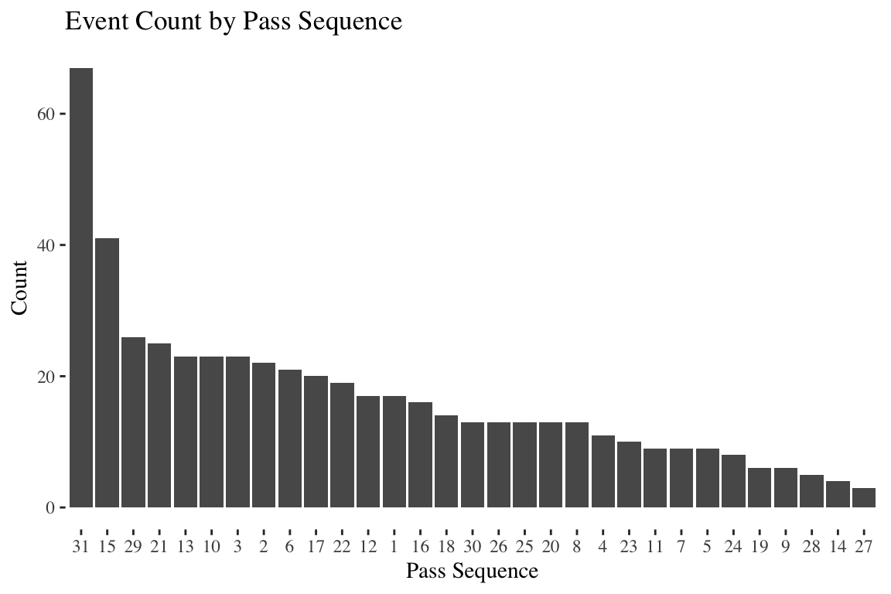
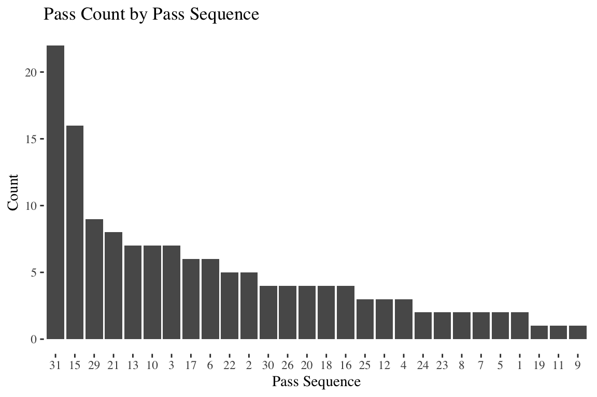

World Cup
================
MsCA Sports Analytics
November, 04 2018

# Overview

Models will be built to focus on the following tasks:

  - Expected goals: all passes that end in a shot

  - Expected possession: all possession for a team

  - Pass map

# Data

All the data for the three models exists in `data/events/19714.json`.
`19714` represents one game. The events folder has events for all games.
There are corresponding `matches` and `lineups` data sets that tie back
to the events. We will focus primarily on `events` for
now

``` r
events_json <- fromJSON("data/events/19714.json", simplifyVector = FALSE)
```

Parse `events_json` to extract relevant data for **expected goals**
model.

``` r
replace_na_empty <- function(x) {
  map_if(x, is.null, ~ NA)
}

event_id <- map_chr(events_json, ~ .x$id)

type_id <- map_int(events_json, ~ .x$type$id)

type_name <- map_chr(events_json, ~ .x$type$name)

timestamp <- map_chr(events_json, ~ .x$timestamp)

possession_team_name <- map_chr(events_json, ~ .x$possession_team$name)

team_name <- map_chr(events_json, ~ .x$team$name)

pass_length <- map(events_json, ~ .x$pass$length) %>% 
  replace_na_empty() %>% unlist()

pass_height <- map(events_json, ~ .x$pass$height$name) %>% 
  replace_na_empty() %>% unlist()

pass_angle <- map(events_json, ~ .x$pass$angle) %>% 
  replace_na_empty() %>% unlist()

duration <- map(events_json, ~ .x$duration) %>% 
  replace_na_empty() %>% unlist()

play_pattern_name <- map_chr(events_json, ~ .x$play_pattern$name)

goalkeeper_type_name <- map(events_json, ~ .x$goalkeeper$type$name) %>% 
  replace_na_empty() %>% unlist()

goalkeeper_outcome_name <- map(events_json, ~ .x$goalkeeper$outcome$name) %>% 
  replace_na_empty() %>% unlist()
```

``` r
events_df <- data.frame(
    event_id,
    type_id,
    type_name,
    timestamp,
    duration,
    team_name,
    possession_team_name,
    play_pattern_name,
    pass_length,
    pass_height,
    pass_angle,
    goalkeeper_type_name,
    goalkeeper_outcome_name
  ) %>%
  #' Used to identify sequences; max `FALSE` value is the start of a sequence
  mutate(lead_possessor = possession_team_name == lead(possession_team_name)) %>% 
  as_tibble()
```

Check index of all shots and then look back to see what lead to a
    shot.

``` r
(shot_indexes <- which(str_detect(events_df$type_name, "Shot")))
```

    ##  [1]   58  198  233  640  649  741  787 1073 1150 1173 1281 1300 1424 1529
    ## [15] 1685 1739 1831 1856 1862 1883 1908 1988 2075 2088 2153 2166 2169 2174
    ## [29] 2445 2642 2716

Pass sequences are defined as uninterrupted possession leading to a
shot.

``` r
sequence_indexes <- vector("list", length(shot_indexes))

for (i in seq_along(shot_indexes)) {
  start_index <- ifelse(i == 1, 1, shot_indexes[i - 1] + 2)
  sequence_indexes[[i]] <- seq(start_index, shot_indexes[i] + 1, 1)
}

shots_split <- map(sequence_indexes, ~ events_df %>% slice(min(.x):max(.x)))

start_sequence <- map_int(shots_split, function(x) {
  x <- x %>% filter(!str_detect(type_name, "Goal"))
  if (sum(which(!x$lead_possessor)) >= 1) {
    max(which(!x$lead_possessor))
  } else {
      min(x$lead_possessor)
    }
  }
) 

pass_sequences <-
  map2(shots_split, start_sequence, ~ .x %>% slice(.y:nrow(.x))) %>%
  map2(., 1:length(shots_split), ~ mutate(.x, pass_sequence_label = .y)) %>%
  bind_rows() %>%
  mutate(
    pass_sequence_label = factor(pass_sequence_label),
    type_name = ifelse(type_name == "Goal Keeper", goalkeeper_type_name, type_name)
  ) %>%
  group_by(pass_sequence_label) %>%
  # Need to account for shots that were block by someone other than the goal keeper when identifying outcome of shot
  mutate(goal = ifelse(
    str_detect(
      goalkeeper_outcome_name,
      "Goal Conceded|Penalty Conceded|No Touch|Touched In"
      ), "goal conceded", "saved"
  ))

pass_sequences %>% 
  select(pass_sequence_label, type_name, goalkeeper_outcome_name, goal) %>% 
  mutate_at(vars(goal), ~ ifelse(is.na(.x), "saved", .x)) %>% 
  distinct(pass_sequence_label, goal)
```

    ## # A tibble: 31 x 2
    ## # Groups:   pass_sequence_label [31]
    ##    pass_sequence_label goal 
    ##    <fct>               <chr>
    ##  1 1                   saved
    ##  2 2                   saved
    ##  3 3                   saved
    ##  4 4                   saved
    ##  5 5                   saved
    ##  6 6                   saved
    ##  7 7                   saved
    ##  8 8                   saved
    ##  9 9                   saved
    ## 10 10                  saved
    ## # ... with 21 more rows

``` r
pass_sequences %>% 
  group_by(pass_sequence_label) %>% 
  slice(1:6) %>% 
  select(pass_sequence_label, everything())
```

    ## # A tibble: 180 x 16
    ## # Groups:   pass_sequence_label [31]
    ##    pass_sequence_l… event_id type_id type_name timestamp duration team_name
    ##    <fct>            <chr>      <int> <chr>     <chr>        <dbl> <chr>    
    ##  1 1                26973b6…       9 Clearance 00:00:45…    0     Manchest…
    ##  2 1                eb189dd…       2 Ball Rec… 00:00:47…    0     Manchest…
    ##  3 1                2dc12a7…      39 Dribbled… 00:00:47…    0     Chelsea …
    ##  4 1                5fcba4e…      14 Dribble   00:00:47…    0     Manchest…
    ##  5 1                9a305bf…      17 Pressure  00:00:48…    0.409 Chelsea …
    ##  6 1                8828286…      30 Pass      00:00:49…    0.395 Manchest…
    ##  7 2                ae2c5e0…      42 Ball Rec… 00:04:24…   NA     Manchest…
    ##  8 2                f1e6140…      10 Intercep… 00:04:24…    0     Chelsea …
    ##  9 2                f1d3bc5…      17 Pressure  00:04:27…    0.229 Manchest…
    ## 10 2                355302d…      30 Pass      00:04:27…    1.16  Chelsea …
    ## # ... with 170 more rows, and 9 more variables:
    ## #   possession_team_name <chr>, play_pattern_name <chr>,
    ## #   pass_length <dbl>, pass_height <chr>, pass_angle <dbl>,
    ## #   goalkeeper_type_name <chr>, goalkeeper_outcome_name <chr>,
    ## #   lead_possessor <lgl>, goal <chr>

``` r
pass_sequences %>% 
  group_by(pass_sequence_label) %>% 
  count() %>% 
  ggplot(aes(fct_rev(fct_reorder(pass_sequence_label, n)), n)) +
  geom_col() +
  labs(title = "Event Count by Pass Sequence",
       x = "Pass Sequence",
       y = "Count")
```

<!-- -->

``` r
pass_sequences %>% 
  count(pass_sequence_label, type_name) %>% 
  filter(type_name == "Pass") %>% 
  ggplot(aes(fct_rev(fct_reorder(pass_sequence_label, n)), n)) +
  geom_col() +
  labs(title = "Pass Count by Pass Sequence",
       x = "Pass Sequence",
       y = "Count")
```

<!-- -->
